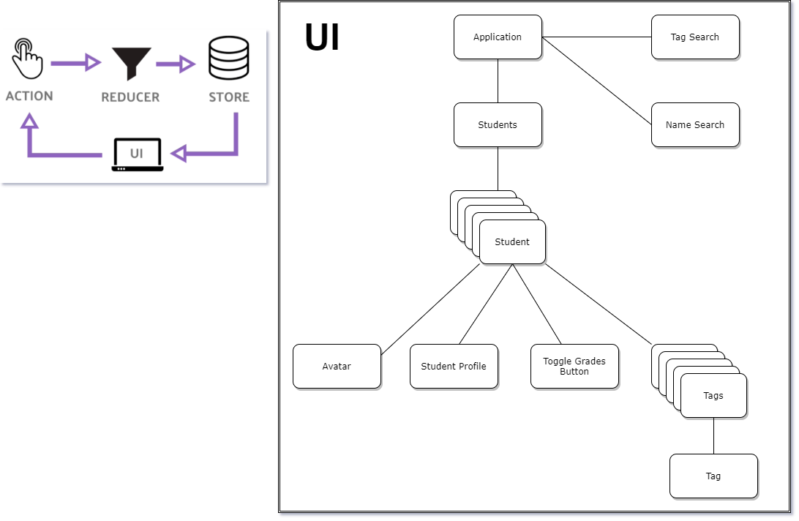

# Robo Friends V2

## How to run the app:

### `npm i && npm start`

## How to run tests:

### `npm test`

## Troubleshooting Installation:

If you run into this issue:
Error: No version of chokidar is available. Tried chokidar@2 and chokidar@3.
run `npm update` first before running `npm start` again.

## Design Decisions:

### State Management

I used useReducer and useContext instead of local storage for state management
You can check commit #6 for the local storage version.

### Responsive Design

I decided the application to have a fixed width and height to replicate the same width and height from the demo. I used the demo videos on fullscreen as reference.

### Vanilla CSS vs TailwindCSS vs CSS Preprocessors

I was thinking of using css preprocessors like Sass or Less since I know it can make my css more modular and reusable. I also know that some projects use TailwindCSS or CSS in JS. But with the interest of time, I stuck with vanilla css since I'm more comfortable with it.

### JavaScript vs TypeScript

I decided to just use JavaScript for now since I'm more comfortable with that.

### Create-React-App vs other bundlers

I decided to use Create-react-app to develop the application. But I could have used other bundlers like Parcel to bundle everything.

### Testing

I only tested the major functionality of the application using one integration test and the rest are unit tests.
I also used the testing library that came with Create-react-app to create my tests.

### Architecture

### Nice to Have:

- Add debounce to search feature for optimization
- Persisting state in some storage either in a database or browserstorage
